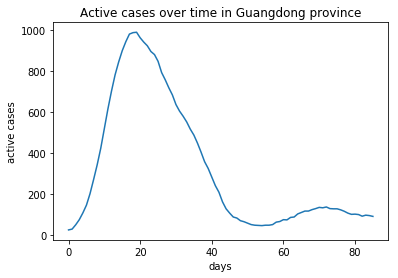
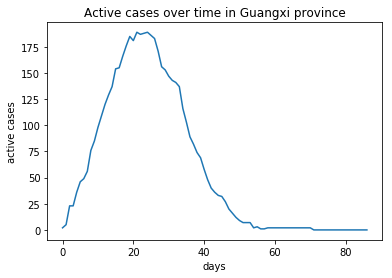
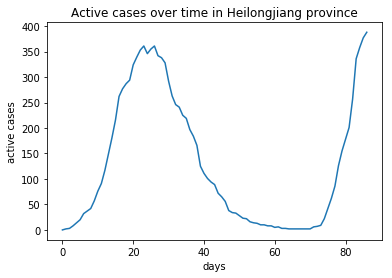

Late day policy: 1 late day with a 20% grade penalty.

The python dependencies required for this homework are listed in ***requirements.txt***. If you are using Anaconda, you can install them by running `conda install --file=requirements.txt`.

**Submission**: Now that you are familiar with using jupyter notebook, you will answer questions in [markdown cells](https://jupyter-notebook.readthedocs.io/en/stable/examples/Notebook/Working%20With%20Markdown%20Cells.html) in the notebook and make a single submission with pdf of the notebook to gradescope. You are free to add additional cells (code or markdown) as needed.

In this homework, you will practice implementing and training simple neural networks using tensorflow and keras. We will use COVID-19 data published by [Johns Hopkins University](https://github.com/CSSEGISandData/COVID-19/tree/master/csse_covid_19_data/csse_covid_19_time_series), specifically its time-series data of active cases (active = confirmed - recovered - death) in all provinces of China except Hubei (because data for Hubei is one to two order of magnitude larger than the rest), up to and including Apr 17. 

The time series for three provinces with different trends and magnitudes are plotted below; our data contains all such time series. 

All numbers in the files we give you are divided by 100, so that the scale is conducive to training. The data is already preprocessed and will be loaded for you. The ***data-gen.ipynb*** notebook is included in the starter code for those interested and contains the process for gathering and generating this data. 

Our regression task is to predict the number of active cases for the next 16 days, given the numbers from the past 16 days. In other words, every 32 consecutive data points in a province is split in half, and we use the first half (input) to predict the second half (output). Arrays x and y contain all such input/output pairs, while (x_train, y_train) and (x_val, y_val) are training and validation sets split from (x, y) using the [train_test_split](https://scikit-learn.org/stable/modules/generated/sklearn.model_selection.train_test_split.html) function we saw before.

**Disclaimer**: the regression task in this homework is tuned for demonstrating concepts of neural networks, but this is not a proper modeling of the pandemic. For credible predictions, follow publications by epidemiologists.

Different activations, corresponding initialization schemes, and different optimizers will be discussed later in the course. For this homework, please use the ones specified in the questions. [Keras documentations](https://www.tensorflow.org/api_docs/python/tf/keras/layers/Dense), and Google, will be helpful throughout this homework to understand the keras APIs. 

Launch ***covid19.ipynb*** to get started.

We start by comparing a wide (layer with many nodes), single-layer network to a narrower (fewer nodes) two-layer network.

1. Build a model with a single fully connected hidden layer of size 32, using **relu** for activation and [**He normal**](https://www.tensorflow.org/api_docs/python/tf/keras/initializers/he_normal) for weight (kernel) initialization. Remember that the output layer doesn't need activation. Compile the model with **Adam** optimizer and use _mean squared error_ as the loss function. Check out the [keras documentation](https://www.tensorflow.org/api_docs/python/tf/keras) and [guide](https://www.tensorflow.org/guide/keras/overview) to see how to specify them. Call the `summary` method of the model to see its details. How many trainable parameters does the model have?

**Note on training**: Take a look at the [fit](https://www.tensorflow.org/api_docs/python/tf/keras/Model#fit) method to understand what arguments are available. We didn't need to specify anything other than the number of epochs, but you are free to experiment. 

Calling `fit` multiple times doesn't start training from scratch but continues from where it left off. So you can execute a cell multiple times with `fit` to see how your model is progressively improving.

If you want to restart a training over from scratch, re-run the cell for model creation (e.g., the one with `model = tf.keras.Sequential()`) to re-build the model. You can also [save your model](https://www.tensorflow.org/tutorials/keras/save_and_load) to be reloaded later.

Training neural networks can be difficult and frustrating because you usually need to tune hyperparameters. Patience and pattern-finding are the keys. The learning rate controls the trade-off between training speed and quality of convergence. For models in this homework, a learning rate in the order of $$10^{-4}$$ might be needed for good convergence. However, if you start with such a low learning rate, the training process can be very time-consuming. Because our dataset and models are relatively stable, you can start training with larger (e.g. default) learning rate, lower it when you see loss stagnates, and train more epochs. You can repeatedly lower the learning rate and train more until the loss plateaus or decreases very slowly (consider the percentage decrease over a couple hundred epochs). 
 
The learning rate can be changed using `model.optimizer.learning_rate.assign(new_lr)`. You are also free to use other approaches, such as using a low learning rate throughout and just train for longer, or use a [scheduler for learning rate](https://www.tensorflow.org/api_docs/python/tf/keras/callbacks/LearningRateScheduler). 
 
For each training question, we will give reference numbers for epochs and loss, but you won't necessarily get the same results since it depends on initialization. You are, however, expected to train your models until certain behaviors occur, which will be specified in questions.

Every call to the `fit` method returns a history object, which contains useful information such as the loss values of the training session. You can plot the loss to see if it is decreasing, and print the average for say, the first and last 10 losses. We provided a `print_dot` callback function that you can use in conjunction with setting the `verbose` option to 0 in `fit`. This reduces the amount of data printed in the notebook output cell. The `print_training_info` function can be used to print the final loss given the history object.

{:start="2"}
1. Train your model with data (x, y) until the loss plateaus or decreases very slowly. For reference, we get a final loss around 0.12 after ~2k total epochs, with a learning rate lowered manually. Report your final loss and final learning rate, describe your training process, and include a plot of the loss function showing its convergence.

1. Now build another model with two hidden layers, both of size 16. Again use **relu** for activation and **He normal** for weight (kernel) initialization. Compile the model with **Adam** optimizer and use _mean squared error_ as the loss function. Call the `summary` method of the model to see its detail. How many trainable parameters does the model have?

1. Similar to question 2, train this model until its loss mostly plateaus. You should achieve a lower loss than that of the first model. For reference, we get final losses between 0.06 and 0.07 after ~2k total epochs. Report your final loss and final learning rate, describe your training process, and include a plot of the loss function showing its convergence.

1. You should see the second model having fewer trainable parameters but achieving lower loss. In your own words, explain this performance difference.

Next, we will look at the problem of overfitting using training and validation data. 

{:start="6"}
1. Before we start, let us make sure our training and validation split is reasonable. Using numpy's [norm](https://docs.scipy.org/doc/numpy/reference/generated/numpy.linalg.norm.html) function, compute the l2 norm for each data point (row) in x_train and x_val. Plot the histograms for the norms of two data sets using plt's [hist](https://matplotlib.org/3.2.0/api/_as_gen/matplotlib.pyplot.hist.html) function. Inspect the two distributions to make sure they are reasonably similar. Comment on these distributions.

1. Build a new model with the same architecture as the one in question 3.

1. Train the model with (x_train, y_train) as training data and (x_val, y_val) as validation data. You should start to see a clear overfit behavior at some point: the training loss decreases, but the validation loss increases. Train a few hundreds of additional epochs after you first observe overfit to ensure we have a overfitted model. Save the model to file as we will need it towards the end for analysis. For reference, we start to see overfit after ~2k total epochs, with a learning rate lowered manually in the process. The training loss is around 0.06 when overfit starts. Report your final losses and final learning rate, describe your training process, and include a plot of losses showing the overfit behavior.

1. In your own words, explain what the model is doing when the training loss decreases, but the validation loss increases. What is the implication of this on the ability for the model to make a prediction on unseen data?

1. We will counter the overfit problem with l2 regularization. Build a new model with the same architecture as the last one, but with [l2 regularization](https://www.tensorflow.org/api_docs/python/tf/keras/regularizers/l2) added to the weights (kernels) only, not the biases. The value of the regularization hyperparameter l in the regularizer will need to be tuned. You can also experiment with using different l in different layers if you wish. Specify the mean squared error as a metric when you compile the model, so you have access to the error without the l2 penalty.

1. Tune your regularization hyperparameter(s) by training the models with different l. We want both errors to stabilize without the validation error increasing in the process; and the optimal value is the smallest l that gives this behavior. For reference, our training and validation error (not loss) converge to 0.06 and 0.1, respectively, after ~4k total epochs. We recommend experimenting with l in the [$$10^{-2}$$, $$10^{-5}$$] range. Report the final l value(s) you tuned along with the final training and validation losses and final learning rate; describe your training process. Also include a plot showing how the errors stabilize to the reported values. Save your best model to file if needed, as we will be performing analysis with it in the following questions.

1. In your own words, explain how l2 regularization counters overfitting.

One of the key signs of an overfitted model is that the model is very sensitive to noise in the input or to the specific choice of training points. Generally speaking if one consider a function $$f(x)$$ the sensitivity can be estimated by computing

$$ \int \left( \frac{df}{dx} \right)^2 p(x) \, dx = E((f')^2) $$

where $$p(x)$$ is the probability density function of $$x$$ and $$E$$ denotes the expectation. To estimate this quantity, we can add some noise $$r$$ to the input $$x$$. Let us assume that we add a small amount of noise such that

$$ f(x + r) \approx f(x) + \frac{df}{dx} r $$

to first-order. The noise $$r$$ is a normal random variable, with mean 0 and variance $$\sigma^2(r)$$, which is uncorrelated with $$x$$. The variance of $$f(x+r)$$ is equal to

<!-- $$ E((f + f'r)^2) = E(f^2) + 2 E(ff'r) + E((f')^2r^2)
= E(f^2) + E((f')^2) E(r^2) $$

$$ E(f+f'r)^2 = (E(f) + E(f') E(r))^2 = E(f)^2 $$ -->

$$\sigma^2(f(x+r)) = \sigma^2(f(x)+f'(x) r) = \sigma^2(f) + \sigma^2(r) E((f')^2) $$

We see that when the noise has variance 0 (i.e., $$\sigma^2(r)=0$$), we get $$\sigma^2(f)$$ as expected. As the variance of $$r$$ increases, the variance of $$f(x+r)$$ increases linearly with slope $$E((f')^2)$$. This slope represents how sensitive the function $$f$$ is to changes in the input $$x$$.

Numerically, this can be estimated by adding some noise $$r_i$$ drawn from a normal distribution to each input variable $$x_i$$ and computing the standard deviation of the output $$f(x_i + r_i)$$. As we vary the variance of $$r_i$$, the rate of change of $$\sigma^2( f(x_i + r_i) )$$ measures the sensitivity.

Below we will compare two different models that have comparable accuracies, but different sensitivities. In that case, the model that has the largest variance for $$f(x+r)$$ is the most sensitive one.

{:start="13"}
1. Let's compare our overfitted and regularized models by investigating how sensitive they are to input noise. You can generate Gaussian noise using [np.random.normal](https://docs.scipy.org/doc/numpy-1.15.0/reference/generated/numpy.random.normal.html). We will generate noise with 0 mean and standard deviations of [0.1, 0.2, 0.3, 0.4, 0.5]. For each standard deviation value, repeat 10 times the following.
    1. generate noise; add the noise to x_val to generate a perturbed input (don't modify x_val itself).
    2. compute the predictions for the perturbed input using both models.
    3. compute the [standard deviation](https://docs.scipy.org/doc/numpy/reference/generated/numpy.std.html) for the two predictions.
    4. compute the mean squared errors for the two predictions using y_val as true value.

    Plot the mean standard deviations and mean squared errors computed above as a function of the standard deviation in the input noise. Qualitatively, based on the plots, comment on the two models' sensitivity to input noise.

1. The provided `plot_data` function plots the true data and predicted numbers for a single or all provinces. The `day` argument specifies which day in the prediction data is used to plot; e.g., day = 0 means that the first number in all predictions are used. Take a look at the function to understand how to use it. Use the regularized model to make a prediction on x. Use the prediction to make some plots and visualize how your model is doing! For a given province, vary the `day` argument to see how the prediction accuracy changes. Use your intuition to explain the patterns you are seeing. For a given value of `day`, find and include plots for two provinces, where one has a noticeably better prediction for the other. Speculate on the reason for the difference (think of the data pattern of the province with bad prediction, and the pattern for most provinces). This kind of "manual troubleshooting" can be helpful in real applications to understand why a model isn't performing well.

1. Load the data for the U.S. (x_us, y_us), and use the `evaluate` method to compute the error of your regularized model on this data. The accuracy should not be very good. Use common sense to explain why a model trained on data from China performs poorly on U.S. data. You can plot the data to visualize the problem if you wish. Based on this, comment on why it is important for the training data to have the same distribution as the expected data for the task (test data).