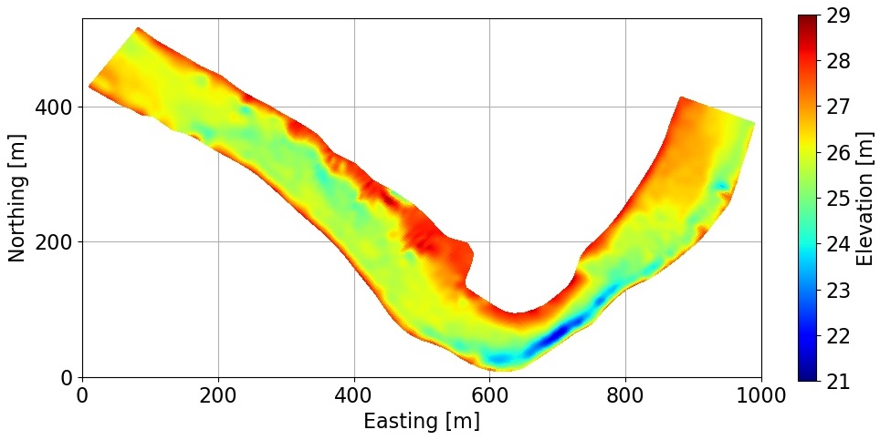
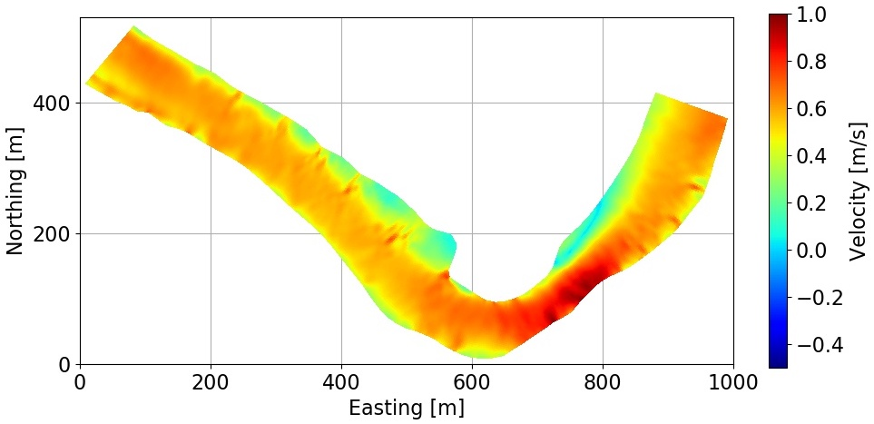

Late day policy: 1 late day with a 20% grade penalty.

The python dependencies required for this homework are listed in ***requirements.txt***. If you are using Anaconda, you can install them by running `conda install --file=requirements.txt`.

**Submission**: Now that you are familiar with using jupyter notebook, you will answer questions in [markdown cells](https://jupyter-notebook.readthedocs.io/en/stable/examples/Notebook/Working%20With%20Markdown%20Cells.html) in the notebook and make a single submission with pdf for each notebook to gradescope. You are free to add additional cells (code or markdown) as needed.

[Starter code and required files](https://ericdarve.github.io/cme216-spring-2020/Homework/hw3_starter_code.zip)

[Data files](https://drive.google.com/drive/folders/1zpZ8T8qq6opAmSz1oapoPBCrwM4WLh5_)

## Problem 1: Forward and inverse modeling

This figure shows 2-D image of a riverbed profile (top) and its corresponding flow velocity (bottom).

In this problem, you are going to use deep learning for forward and inverse modeling. Once a deep neural network is provided with a dataset consisting of the parameters of a partial differential equation (PDE) such as boundary conditions or initial conditions and the solution of the PDE, the trained network can be used as a fast forward or inverse solver, replacing the computationally expensive numerical solver of the PDE (or its inverse). 

Here, we focus on shallow water equations, which are a set of PDEs that describe flow velocity in a river given the profile of the riverbed. Shallow water equations are a set of hyperbolic partial differential equations for describing flow velocities which are derived from Navier-Stokes equations by assuming that the horizontal length scale is much greater than the vertical length scale, such as flow inside a river. Conservation of mass under this condition implies that the vertical flow velocity scale is small compared to the horizontal flow velocity scale. Therefore, in this problem, we only focus on the relationship between riverbed profile and horizontal flow velocities.

Our fast forward solver replaces the shallow water equations while our fast inverse solver learns a map from flow velocity measurements to riverbed profile. There are several inverse modeling techniques such as geostatistical approach or Kalman filtering techniques to solve the inverse problem. However, these methods can be computationally expensive for online application. Here, you will learn to apply fully connected deep neural networks to estimate the flow velocity from the depth of a river and vice versa.

In order to simplify the problem, you only need to model the forward and inverse problem on a small segment of the river profile. Also, in order to reduce the dimension of the problem, the riverbed profiles are projected to their first $$k$$ important directions using the PCA technique (principal component analysis). We will discuss this projection method in Problem 2. 

Therefore, the input vector of your network in forward modeling is a vector with $$k$$ elements (here, $$k=41$$) that corresponds to the subspace of dimension $$k$$ that best approximates the riverbed profiles. The output is the flow velocity. Conversely, the input vector of your network in inverse modeling is the flow velocity measurement, and the output is the $$k$$ largest eigenvalues of the riverbed profiles. 

Note that the data are preprocessed. The matrix $$X$$ in the dataset corresponds to the flow velocity for each segment, while the matrix $$Y$$ corresponds to the first $$k$$ directions for each riverbed profile.

1. Constructing the model. 10 points. Complete the "generate-model()" function in the starter code. For simplicity, the number of layers and the number of hidden units are given as a list to the function. Use the same parameters (activation function, regularization coefficient, &hellip;) for all the layers except the last layer. What type of activation function do you use for the last layer? Why? Explain what type of loss function and evaluation metrics you selected and provide the reasoning. Consider adding batch normalization layers to your network structure. 
1. Training the forward model. 10 points. Complete the "train()" function and then set up your network parameters and train your network. Note that your output is the flow velocities. You need to select the network parameters such as the number of layers, the number of hidden units, regularization parameters, etc. Use 80% of the data for the training set and 20% for the validation set. What is the number of epochs that you selected? Why? Plot the loss function for the training set and the validation set. 
1. Hyper-parameter selection. 10 points. In this section, you will learn how to select hyper-parameters for the forward modeling problem. For simplicity, we try to find only two hyper-parameters, which are regularization coefficient and learning rate decay. Here, we only run the network for 10 epochs to get results faster. Complete the "hyp-tuning()" function and call the function. Report the optimal values for the regularization coefficient and learning rate decay.
1. Optimal forward model network. 15 points. Train your network for the optimal hyper-parameters that you found in the previous part and use the "plot-forward()" function that is provided to you to load the test dataset and plot the results. What is the root mean square error (RMSE) of the velocity in the test dataset? What is the RMSE of the velocity in your validation dataset?
1. Training the inverse model. 15 points. Use the "hyp-tuning()" function to find the optimal network for the inverse model and train it using "generate-model()" and "train()" functions. Note that your input here is the flow velocity. Use the "plot-inverse()" function that is provided to you to load the test dataset and plot the results.

## Problem 2: Fast low-dimensional solver

The file P2_train.mat is not in the starter code, please download it [here](https://drive.google.com/open?id=1zpZ8T8qq6opAmSz1oapoPBCrwM4WLh5_).

In many real-world applications, we encounter high-dimensional problems (imagine 100,000 dimensions) for which applying a deep neural network directly from their input to output is difficult. This is either due to the large size of the DNNs required to process the input, which that makes them computationally very expensive (or impossible to train!). Or it may be due to the large dataset size that we require to train such large networks in order to guarantee that overfitting does not happen. 

It is therefore useful to reduce the dimension of the input and output of such problems as a pre-processing step and then train a network from low dimensional input to low dimensional output. For these reasons, dimension reduction is an important topic in machine learning, and many different linear and nonlinear methods have been developed in order to reduce the dimension of high dimensional data without losing too much of the information contained in the original dataset. 

In this problem, you are going to combine a linear dimension reduction technique with deep learning to replace a numerical PDE solver with a low-dimensional DNN model. You will use the same dataset that was provided to you in Problem 1. Therefore, you should first copy-paste your functions from Problem 1 here for network training.

The linear dimension reduction technique that we use here is the principal component analysis (PCA) which gives you the optimal linear transformation of the data that preserves most of its information content. There are different ways of doing PCA. We are going to apply the technique to matrix $$V$$ (input data X). Denote $$v_i$$ column $$i$$ of $$V$$ and denote $$n$$ the number of columns of $$V$$. Each column of $$V$$ is a different velocity sample. Assume that we have removed the mean from all the variables:

$$ v_{ij} \leftarrow v_{ij} - \frac{1}{n} \sum_{k=1}^n v_{ik} $$

This process is called centering the variables. One way of doing PCA is to calculate

$$ K = V V^T = \sum_{i=1}^n v_i v_i^T $$

Compute the singular value decomposition (SVD) of $$K$$:

$$ K = U \Sigma_0 U^T $$

where $$\Sigma_0$$ is a diagonal matrix with all entries positive. Matrix $$U$$ can be used to reduce the dimension of the input. Assuming that the entries $$[\Sigma_0]_{ii}$$ are sorted from large to small (the default) then the first $$l$$ components for vector $$v_j$$ are

$$ u_i^T v_j, \quad 1 \le i \le l, \; 1 \le j \le n $$

where $$u_i$$ is column $$i$$ of $$U$$. This projection method is called PCA. The $$u_i$$ are the directions that capture most of the variability of the data.

In this homework, we will use a simpler projection method which works on $$V$$ directly.

$$ V = U \Sigma_1 U_1^T $$

It's less efficient than the previous decomposition when $$n$$ is very large (but this is not the case here). You can check that working with $$K$$ or $$U$$ leads to the same $$U$$ by uniqueness of the SVD.

Using PCA, we can now work with the $$l$$ most important directions of the data. 

For more information on PCA, you may read:

- In [Deep Learning](http://www.deeplearningbook.org/) Section 2.12 (p. 45 in [Chapter 2](http://www.deeplearningbook.org/contents/linear_algebra.html)), and Section 5.8.1 (p. 145 in [Chapter 5](http://www.deeplearningbook.org/contents/ml.html)). Note that matrix $$X$$ is transposed in the book compared to this homework notations.
- See Chapter 8 in [Hands-On Machine Learning with Scikit-Learn, Keras, and TensorFlow.](https://searchworks.stanford.edu/view/13489354)
- [Wikipedia article](https://en.wikipedia.org/wiki/Principal_component_analysis) _Principal component analysis_

Moving on to your tasks, first, you should perform PCA on the dataset to reduce its dimension. Then, apply deep learning to find a relationship between low-dimensional input (river profiles) and output (velocities). 

{:start="6"}
1. Perform the PCA. 20 points. Perform principal component analysis by applying singular value decomposition (SVD) on the velocity data. 

You can use Numpy built-in function "svd" to perform PCA. This function provides you with the most important eigenvectors of the data in descending order of their eigenvalues, from which you can calculate a low-rank approximation of the data using

$$ V_l = U_l^\text{T} V,$$

where $$V$$ is the matrix of data without dimension reduction (such as velocity), $$U_l$$ is the matrix consisting of the first $$l$$ columns of the matrix of eigenvectors (principal components) that you can obtain from "svd", and $$V_l$$ is the low-rank $$l$$-dimensional representation of $$V$$. You can also use 

$$\hat{V} = U_l V_l,$$

to find the representation of the low-rank data in the original space. The reconstruction error is defined as the error that you obtain after projecting your data onto the low-dimensional space and augmenting it back to the original space, $$\| v - \hat{v} \|$$. After performing SVD, plot the reconstruction RMSE of the flow velocity as a function of the number of principal components being used, $$l$$. How does the error change as you increase $$l$$?

{:start="7"} 
1. PCA-DNN. 20 points. In this part you will combine PCA with a deep neural network (DNN) to replace the shallow water equations with a low-dimensional function. Find a number of principal components, $$l$$, on your plot for question 6 for which the reconstruction RMSE of velocity is about 10% of the RMSE of velocity in the validation set without dimension reduction that you found in Problem 1. Then train a DNN from eigenvector space of river profiles to the low-dimensional space of velocity. Note that the output of your network should be of dimension $$l$$. Use 80% of the data for the training set and 20% for the validation set. How do the RMSE of validation and test dataset of flow velocity compare to those found in Problem 1 part 4? What about the size of the two networks and the computational cost of their training (only provide a qualitative comparison of computational cost and network size)? You can copy-paste your codes from Problem 1.