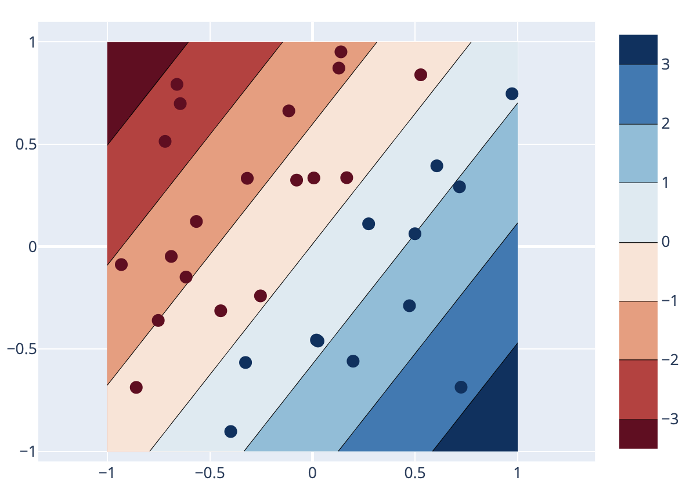

In computational engineering, we are used to solving problems by using physical laws. For example, we may consider a falling body. We apply Newton's second law to obtain $$\vec{F} = m \vec{a}$$. The force $$\vec{F}$$ may then be set equal to $$m \vec{g}$$ where $$\vec{g}$$ is gravity. By specifying initial conditions $$\vec{r}(0)$$ and $$\vec{r}'(0)$$ and integrating in time, we can find the trajectory $$\vec{r}(t)$$ for all times $$t$$.

Our prediction is based on physical laws and a solution is found after we specify some initial conditions.

There are many other examples such as computing the motion of a spring-mass system based on Hooke's law, $$F = k x$$. A more complex example is the motion of a fluid flow satisfying the Navier-Stokes equations:

$$ \rho \frac{\partial \vec{u}}{\partial t} + \rho \vec{u} \cdot \nabla \vec{u} = 
- \nabla p + \nabla \cdot \tau + \rho \vec{g} $$

where $$\vec{u}$$ is the flow velocity, $$\rho$$ is the density, $$p$$ the pressure, $$\tau$$ is the deviatoric stress tensor, and $$\vec{g}$$ represents body forces like gravity.

Machine learning takes a different approach to make predictions. Generally speaking, it does not make use of physical laws, such as the conservation of momentum or energy (although there are exceptions as we will see), but rather it is based on sampled data, typically called "training data." A well-known example is the problem of linear regression. We are given some samples $$(x_i,y_i)$$, $$i = 1, \dots, m$$, and we are interested in building a model of the type $$y = w^T x + b$$ that relates $$y$$ to $$x$$ with a linear relationship. Typically, the vector $$w$$ and scalar $$b$$ do not exist. That is, there is no $$w$$ and $$b$$ such that $$y_i = w^T x_i + b$$ exactly for all points $$(x_i,y_i)$$ in our training set. Instead, for example, we are going to look for $$w$$ and $$b$$ such that they minimize the mean square error

$$ \sum_{i=1}^m \| y_i - w^T x_i - b \|_2^2 $$

Machine learning relies on many disciplines in mathematics and statistics, such as statistical modeling, computational statistics, optimization. Tom Mitchell in [_Machine Learning_](https://searchworks.stanford.edu/view/3427993) provides a formal definition of the concept of learning by computer programs (page 2).

_Definition:_ A computer program is said to learn from experience _E_ with respect to some class of tasks _T_ and performance measure _P_ if its performance at tasks in _T_, as measured by _P_, improves with experience _E_.



The key in this definition is that the accuracy of our prediction improves with _E_, for example, if we acquire more data (increase $$m$$ above) or improve the quality of the data (if we assume that the data is noisy or somehow corrupted). This is therefore qualitatively different from the previous approach described at the beginning, based on deriving and applying general physical laws. Machine learning is, therefore, most effective when deriving such laws or mathematical model _a priori_ (that is in the absence of data) is difficult.

## Supervised learning

There are broadly speaking two main tasks in machine learning that we will be concerned about: classification and regression. 

1. The first one is **classification.** In this problem, we assume that for each point $$x = (x_1, \dots, x_d)$$ we need to assign or predict a label or category, which is typically represented by an integer. It may represent for example the type of object represented in an image, a cat, a dog, or a car. In engineering, $$x$$ may represent the result of some experimental measurements for a bridge for example, and the label may represent whether we believe there is a fracture or damage to the structure: $$+1$$ if true and $$-1$$ if false. Or similarly, $$x = (x_1, \dots, x_T)$$ may be a time-resolved signal, for example the vibrations of a mechanical part, and the label may represent a mechanical failure: $$+1$$ if a failure is detected, $$-1$$ otherwise.

2. The second one is **regression.** In that case, we may be interested in some function $$u(x) \in \mathbb R$$ which is real-valued. It may be a scalar quantity like the pressure, a vector, like the velocity, or a tensor, like the stress, or strain in a solid. This case is more common than classification in engineering. We previously gave the example of linear regression.

We are going to start with the problem of regression for simplicity.

In the figure below, the points on the top left in red have a label $$+1$$ and the ones in the bottom right in blue have a label $$-1$$. In this case, $$x = (x_1,x_2)$$ is a vector in $$\mathbb R^2$$.

{:width="400px"}

This is an example of a **supervised** learning task. That is we are given some data points $$x_i$$ in 2D along with their labels, $$+1$$ or $$-1$$.

**Unsupervised** learning is concerned with a different set of tasks. For example, given a set of points $$x_i$$ (without any label), unsupervised learning may attempt to cluster these points into sets or clusters that are "well-separated" from each other.



## Machine learning in computational engineering

Computational engineering has unique requirements, which are different from image and signal processing, or computer vision. 

1. Regression is a much more common application than classification. In most cases, we are interested in computing a pressure, velocity, or strain field.
2. The accuracy is typically high. For example, we often expect errors in the range $$10^{-4}$$&ndash;$$10^{-3}$$ or less to have confidence in the prediction.
3. Data is more limited. Data in computational engineering is typically obtained either through experiments, which may be expensive and typically do not generate large amounts of data, or high-fidelity computer simulations. However, the advent of automated sensors and large-scale parallel computers is changing this landscape.
4. We are often interested in quantifying the uncertainty in the prediction and deriving confidence of intervals for our prediction.
5. We can leverage equations from physics, conservation laws, physical principles, which can inform our learning algorithms. This is different from other applications in computer science for example where most of learning is restricted to learning from data. {% include marginnote.html note='See for example [recent research papers](https://scholar.google.com/scholar?hl=en&as_sdt=0%2C5&q=physics+informed+deep+learning&btnG=) on this topic.'%}