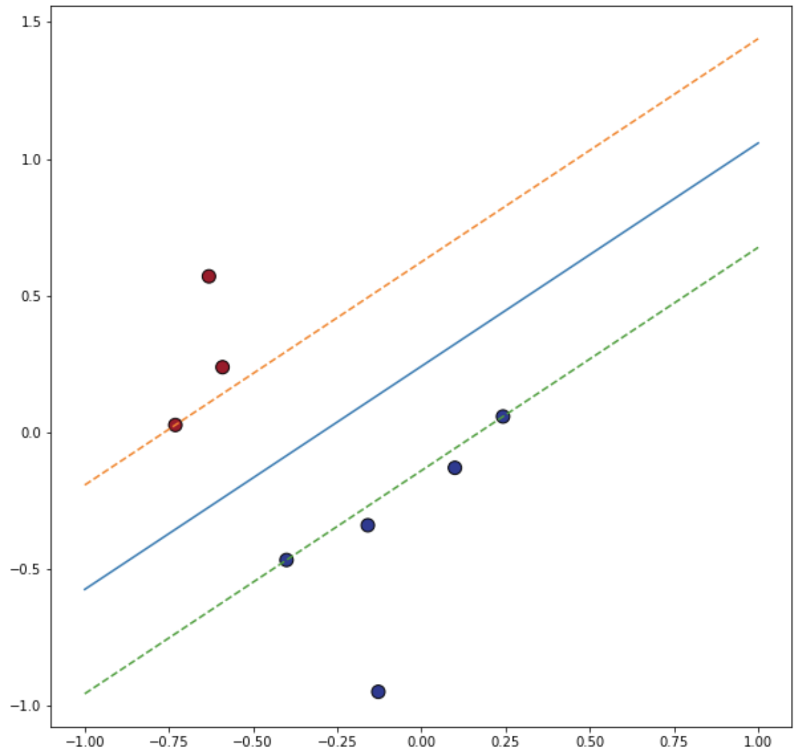
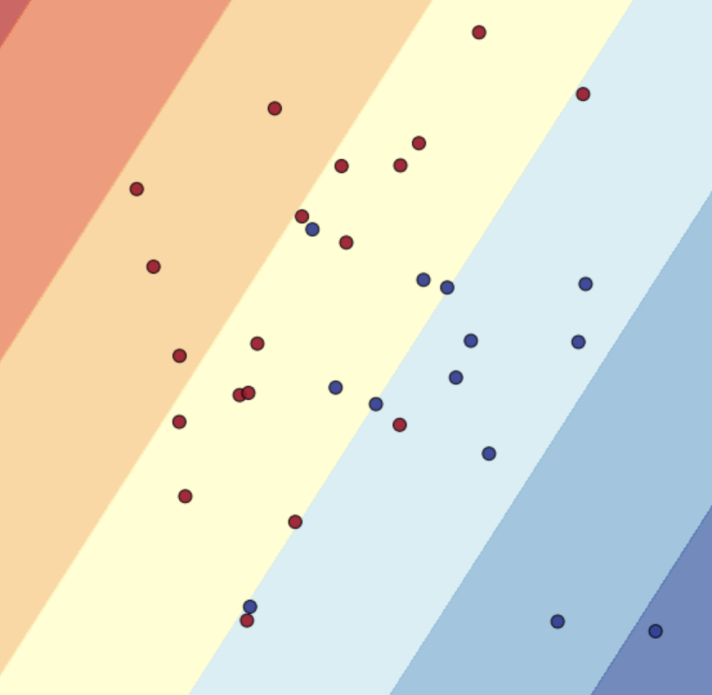

Support vector machine (SVM) is one of the simplest methods for classification. In some sense, it forms a stepping block to neural networks and deep learning.

SVM is a method for binary classification. That is, we are given a point $$x \in \mathbb R^n$$, and we want to predict a label with possible values $$+1$$ or $$-1$$.

In SVM, the space $$\mathbb R^n$$ of possible $$x$$ is subdivided into 2 half-space by a hyperplane: a line in 2D or a plane in 3D. On one side of the hyperplane, the label is $$1$$ and is $$-1$$ on the other.

In the example below, the line that separates the $$-1$$ labels from $$+1$$ is simply $$y = x$$. The $$-1$$ labels are in the top left and the $$+1$$ in the bottom right.

{:width="400px"}

However, if the training data that we are given are only the colored dots, we cannot exactly determine the separating line $$y = x$$. So instead, based on the observed data (the dots), we ask what the best hyperplane we can find is.

The hyperplane is defined by a normal vector $$w$$ and a bias $$b$$:

$$ w^T x + b $$

In SVM, the best hyperplane is defined as the one that has the largest **margin,** that is the one which the points are the farthest from. This makes the classifier more robust and accurate.

In the figure below, the "exact" solution is $$y = x$$ (the solid blue line), but this is unknown to us. Instead, we observe only the colored dots. Based on this, the best line of separation is the black solid line in the middle. We will see later how this can be formulated mathematically and how the black line can be computed.

The dashed lines are two lines that are parallel to the black solid line. The red dot on the top dashed line is at a distance $$h$$ from the black solid line. The blue dots on the bottom dashed line are also at a distance $$h$$ from the black solid line.

{:width="400px"}

The goal in SVM is to determine the equation of the black solid line such that the distance $$h$$ is maximum. By definition, no training points (the colored dots) can reside between the dashed lines. The black solid line must be equidistant from the two dashed lines.

Let's now see how this can be formulated mathematically.

The first step is calculating the distance of a point to the separating hyperplane (black solid line above). This hyperplane will be defined by the equation $$ w^T x + b = 0 $$ where $$w$$ is a vector in $$\mathbb R^n$$ and $$b$$ is a scalar.

Take a point $$x$$ not on the hyperplane. How far is it from the hyperplane? You can prove that the distance $$\delta$$ is

$$ \delta = \frac{|w^T x + b|}{\|w\|} $$

We then need to search for $$(w,b)$$ that makes $$\delta$$ as large as possible.

The division by $$\|w\|$$ indicates that there is a scaling invariance in this problem. We can multiply $$w$$ and $$b$$ by any constant $$C$$ and the hyperplane/classifier is the same. 

To normalize, we choose $$w$$ and $$b$$ such that

- $$y_i (w^T x_i + b) \ge 1$$ for all $$i$$, and
- there must be some $$i$$ for which $$y_i (w^T x_i + b) = 1$$. This happens for the point(s) that is closest to the plane. This point is the one used for normalization.

Let's denote by $$\rho$$ the distance of the point **closest** to the hyperplane. Then:

$$ \rho(w,b) = \min \frac{|w^T x_i + b|}{\|w\|} $$

With our normalization this becomes simple:

$$ \rho(w,b) = \frac{1}{\| w \|} $$

since $$ \| w^T x_i + b \| = 1 $$ for the nearest point.

We now want to find $$w$$ such that $$\rho$$ is maximum. To solve this problem, we can re-write it as a quadratic programming problem. We don't need to know what this is in detail but what matters is that there are efficient methods to solve this type of problem. Since we want to maximize the distance of the nearest point $$\rho$$, we can as well minimize $$\| w \|_2$$. So we search for

$$ (w,b) = \text{argmin}_{w,b} \frac{1}{2} \|w\|_2^2 $$

subject to the constraint

$$ y_i (w^T x_i + b) \ge 1 $$

For the optimal solution, there must be at least one $$x_i$$ for which

$$ y_i (w^T x_i + b) = 1 $$

These $$x_i$$s are called **support vectors.** 

In our figure above, the red and blue dots lying on the dashed lines are the support vectors. The black solid line is our best guess $$w^T x + b = 0$$ where $$x$$ is a point in the plane $$x = (x_1,x_2)$$.

### scikit-learn

To demonstrate how SVM works we are going to use [scikit-learn](https://scikit-learn.org/). This library can perform many important computations in machine learning including supervised and unsupervised learning. 

We are going to demonstrate our concept through a simple example. Let's generate 8 random points in the 2D plane. Points in the top left are assigned the label $$-1$$ and points in the bottom right are assigned a label $$-1$$.

In Python, we set up two arrays X (coordinates) and y (labels) with the data:

```python
print('Shape of X: ', X.shape)
print(X)
print('Shape of y: ', y.shape)
print(y)

Shape of X:  (8, 2)
[[-0.1280102  -0.94814754]
 [ 0.09932496 -0.12935521]
 [-0.1592644  -0.33933036]
 [-0.59070273  0.23854193]
 [-0.40069065 -0.46634545]
 [ 0.24226767  0.05828419]
 [-0.73084011  0.02715624]
 [-0.63112027  0.5706703 ]]
Shape of y:  (8,)
[ 1.  1.  1. -1.  1.  1. -1. -1.]
```

Computing the separating hyperplane is done using
```python
from sklearn import svm
clf = svm.SVC(kernel="linear",C=1e6)
clf.fit(X, y)
```

`clf` now contains all the information of the SVM. We will learn later on what the constant `C` is.

To visualize the result, we can plot the black solid line that separates the points. Recall that the equation of the line is

$$ w^T x + b = 0 $$

The vector $$w$$ is given by `clf.coef_`:

```python
print(clf.coef_)
[[ 2.1387469  -2.62113502]]
```

and $$b$$ is given by `clf.intercept_`:

```python
print(clf.intercept_)
[0.63450173]
```

We can plot the points and line using

```python
fig, ax = plt.subplots(figsize=(10, 10))
# points; red = label "-1"; blue = label "+1"
ax.scatter(X[:, 0], X[:, 1], c=y, s=100, cmap=plt.cm.RdYlBu, edgecolors='black')
# solid blue line
x_df = np.linspace(-1, 1, 2)
a = -clf.coef_[0,0] / clf.coef_[0,1]
b = -clf.intercept_ / clf.coef_[0,1]
ax.plot(x_df,a*x_df + b)
```

We can also visualize the support vectors.

```python
print(clf.support_vectors_)
[[-0.73084011  0.02715624]
 [-0.40069065 -0.46634545]
 [ 0.24226767  0.05828419]]
```

There are 3 points in this case. The lines going through these points satisfy the equations

Top line

$$ w^T x + b = -1 $$

Bottom line

$$ w^T x + b = 1 $$

These lines can be plotted using

```python
# orange line
b = -(1 + clf.intercept_) / clf.coef_[0,1]
ax.plot(x_df,a*x_df + b, linestyle='dashed')
# green line
b = -(-1 + clf.intercept_) / clf.coef_[0,1]
ax.plot(x_df,a*x_df + b, linestyle='dashed')
```

Here is the final plot:

{:width="400px"}

The blue line is the "farthest" away from the red and blue dots. All the support vectors are at the same distance from the blue line.

### Soft-margin

For many problems, though, because of noise and complex data it is not possible to have a hyperplane that exactly separates the data. In that case, there is no solution to our optimization problem.

The figure below shows an example where there is no line that divides the red dots from the blue dots. The optimization problem from the previous section has no solution in that case.

{:width="400px"}

So we need to introduce slack variables so that some constraints can be violated but in a minimal way

$$ y_i (w^T x_i + b) \ge 1 - \xi_i $$

with $$\xi_i \ge 0$$. If the constraints $$y_i (w^T x_i + b) \ge 1$$ can be satisfied then $$\xi_i = 0$$.

If $$\xi_i > 0$$, then the constraint is weakly violated but the classification is still correct. The sign of $$w^T x_i + b$$ is still the same as $$y_i$$. 

But, if $$\xi_i > 1$$ then the data is **misclassified.** The sign of $$w^T x_i + b$$ is now different from the sign of $$y_i$$. Hopefully this only happens for very few points.

New optimization problem:
 
$$ (w,b,\xi) = \text{argmin}_{w,b,\xi} \frac{1}{2} \|w\|_2^2 + C \sum_{i=1}^n \xi_i $$

$$ y_i (w^T x_i + b) \ge 1 - \xi_i $$

$$ \xi_i \ge 0 $$

$$C$$ is set by the user and determines how much slack we are allowing. 

Large $$C$$ means little violation. Very few points are allowed to violate. The hyperplane is strongly determined by the points nearest to the hyperplane. The hyperplane is very sensitive to points that violate.

Small $$C$$ means a lot of violation are possible. Small $$C$$ is required when data has a lot of noise that needs to be filtered out. In that case, many violations will be accepted as long as this leads to a large separation $$1/\|w\|$$.

{width=50%}

### Optimization

We need to take a small detour through optimization methods to solve our problem.

We will just recall the main results without justifications in the interest of time.

$$ \text{min}_x f(X) $$

$$ g_i(x) \le 0 \qquad h_i(x) = 0 $$

Introduce Lagrangian

$$ L(x;\lambda,\nu) = f(x) + \sum_i \lambda_i g_i(x) + \sum_i \nu_i h_i(x) $$

Then we look for the solution in the form:

$$ \min_x \max_{\lambda, \nu; \lambda_i \ge 0} L(x;\lambda,\nu) $$

This is called the primal formulation of the optimization problem.

Note that if $$x$$ does not satisfy the constraints, then 

$$ \max_{\lambda, \nu; \lambda_i \ge 0} L(x;\lambda,\nu) = +\infty $$

So certainly when computing $$\min_x$$ we are not going to select those points. However, the min max formulation is important to connect this problem to the dual problem.

## Dual formulation

It turns out that we can formulate this problem not in terms of the primal variables $$x$$ but in terms of the Lagrange multipliers $$\lambda$$, $$\nu$$ (the dual variables). This leads to a dual formulation of the problem:

$$ \max_{\lambda, \nu; \lambda_i \ge 0} \min_x L(x;\lambda,\nu) $$

This is the formulation we will be using later on.

### Karush-Kuhn-Tucker (KKT) conditions

For our classification problem with slack the solution satisfies KKT conditions. They are:

$$ \partial_x L = \partial_{\nu_i} L = 0 $$

This means

$$ \partial_x f + \sum_i \lambda_i \partial_x g_i(x) + \sum_i \nu_i \partial_x h_i(x) = 0 $$

$$ h_i(x) = 0 $$

For $$\lambda_i$$ it's a bit more complicated. Either the optimal solution satisfies

$$ g_i(x) < 0 $$

in which case $$\lambda_i = 0$$. But if $$g_i(x) = 0$$ then the Lagrange multiplier must be "activated" and $$\lambda_i > 0$$ (the sign of $$\lambda_i$$ is determined by the sign of the constraint $$g_i \le 0$$).

So the final conditions are:

$$ g_i \le 0 \qquad \lambda_i \ge 0 \qquad \lambda_i g_i = 0 $$

### SVM primal optimization

We want to solve

$$ (w,b,\xi) = \text{argmin}_{w,b,\xi} \frac{1}{2} \|w\|_2^2 + C \sum_{i=1}^n \xi_i $$

$$ y_i (w^T x_i + b) \ge 1 - \xi_i $$

$$ \xi_i \ge 0 $$

With the Lagrange multipliers:

$$ L = \frac{1}{2} w^T w + C \sum_{i=1}^n \xi_i$$

$$ + \sum_i \lambda_i (
    1 - \xi_i - y_i (w^T x_i + b)) - \sum_i \nu_i \xi_i $$

### Solution 

We use the dual formulation for this. First step is taking the minimum over $$w$$, $$b$$ and $$\xi_i$$. Then we will take the maximum over the Lagrange multipliers.

Let's find equations satisfied by the solution.

- $$\partial_w$$: $$w - \sum_i \lambda_i y_i x_i = 0$$
- $$\partial_b$$: $$\sum_i \lambda_i y_i = 0$$
- $$\partial_{\xi_i}$$: $$C - \lambda_i - \nu_i = 0$$

After taking the minimum, the Lagrangian is

$$ L = \frac{1}{2} \sum_{ij} \lambda_i \lambda_j y_i y_j x_i^T x_j + \sum_i \lambda_i (1 - y_i (\sum_j \lambda_j y_j x_j^T) x_i) $$

$$ L = - \frac{1}{2} \sum_{ij} \lambda_i \lambda_j y_i y_j x_i^T x_j + \sum_i \lambda_i $$

$$ \max_{\lambda_i \ge 0, \nu_i \ge 0} L $$

$$ \sum_i \lambda_i y_i = 0, \qquad
\lambda_i + \nu_i = C $$

which can be further simplified to just

$$ \max_{0 \le \lambda_i \le C} - \frac{1}{2} \sum_{ij} \lambda_i \lambda_j y_i y_j x_i^T x_j + \sum_i \lambda_i $$

$$ \sum_i \lambda_i y_i = 0 $$

<!-- $$ y_i (w^T x_i + b) \ge 1 - \xi_i \qquad \xi_i \ge 0 $$ -->
<!-- $$ \lambda_i (1 - \xi_i - y_i (w^T x_i + b)) = 0 $$ -->
<!-- $$ \nu_i \xi_i = 0 $$ -->

*End of lecture 4*

### Training, validation, and testing set

{width=50%}

Hypothesis set: set of all models that can be used to explain the data.

$$\hat{R}(h^\star)$$: best model best on observing a sample of the data.

$$R(h^\sharp)$$: assuming a prior distribution and computing posterior probabilities based on given observations. Optimal if the prior is known.

$$R(h^\star)$$: error from generalization

In our case, we can vary $$C$$ to change the "richness". Small $$C$$ = poor hypothesis set. Large $$C$$ = overfitting, violations are minimal. $$R(h^\star)$$ is large.

Goal is to vary $$C$$ until $$R(h^\star)$$ starts increasing.

The optimization has essentially two phases:

- $$(w,b,\xi)$$: optimized based on training set
- $$C$$: optimized based on validation set

Definitions:

- training set: The sample of data used to fit the model. This is used to calculate $$(w,b,\xi)$$. If we do data fitting using a polynomial of order $$n$$, we use the training set to calculate the coefficients of the polynomial.

- Validation set: The sample of data used to provide an unbiased evaluation of a model fit on the training dataset, while tuning model hyperparameters. The evaluation becomes more biased as the error feedback from the validation dataset is incorporated into the model hyper-parameters. This corresponds to tuning $$C$$ or the polynomial order $$n$$.

- Test set: The sample of data used to provide an unbiased evaluation of a final model fit on the training dataset. No more optimization is done at this stage. This is performed outside of the optimization loop.

Pseudo-code:

```Python
# split data
data = ...
train, validation, test = split(data)

# tune model hyperparameters
parameters = ...
for params in parameters:
    model = fit(train, params)
    # optimize the model based on train
    error = evaluate(model, validation)
    # evaluate the model on validation
    # use error to optimize the hyperparameters

# evaluate final model using test
error = evaluate(model, test)
```

### Approximation-generalization tradeoff

Another terminology that describes something very similar.

Say we want to approximate $$\sin(x)$$. We are given some samples and we fit a polynomial, for example a constant, linear or higher order.

{width=50%}

Left: approximation by a constant. Right: approximation by a linear function based on 2 samples.

{width=50%}

$$\bar{g}(x)$$: average prediction. Gray region: variance of prediction depending on the training set. Bias: difference between $$\bar{g}$$ and truth. Variance: variance in prediction due to random training set. Left: constant polynomials. Right: linear polynomials.

**Approximation:** how accurately can your model approximate $$f$$? That is considering polynomials of order $$n$$, how closely can they approximate $$\sin(x)$$?

Typically you want a large $$n$$ to get a better approximation.

**Generalization:** the problem is you only see a few sample points, not the entire function. This leads to two errors: $$E_{in}$$ errors for the sample points you have seen. $$E_{out}$$: errors for other sample points that you have not seen. This is basically the training and validation sets. We say that a model generalizes well if $$E_{in} \sim E_{out}$$.

Typically you want a small $$n$$ for the model to generalize.

You need to find the right trade-off. The optimal $$n$$ depends on how many sample points you are allowed to see. The more sample points the larger $$n$$ should be.

{width=50%}

### Kernel trick

A genius idea. You can see that the Lagrangian is based on dot products with $$x_i$$: $$x_i^T x_j$$. The prediction requires

$$ w^T x + b = \sum_i (\lambda_i y_i) \; x_i^T x + b $$

and similarly in the definition of $$L(\lambda,\nu)$$.

The vectors $$x_i$$ only show up through dot products.

This suggests several extensions.

Instead of considering $$x$$, we can consider some non-linear function of $$x$$, $$\phi(x)$$, called features. Then the dot products $$x^T x'$$ become

$$ \phi(x)^T \phi(x') = \sum_k \phi_k(x) \phi_k(x')$$

We may decide to use a weighted dot product

$$ \sum_k \sigma_k \phi_k(x) \phi_k(x') $$

The downside of this is that we need to calculate all these $$\phi_k(x)$$. But there is a simple way around this. Define the kernel function

$$ K(x,x') =  \sum_{k=1}^r \sigma_k \phi_k(x) \phi_k(x') $$

This is a simple evaluation; no dot product or function $$\phi_k$$ to evaluate any more.

But in fact, many kernels we are familiar with can be written in this form. It's just an SVD of the kernel. Any kernel that satisfies the assumption for Mercer's theorem ($$K$$ is a continuous symmetric positive semi-definite kernel; we skip the technical details here) can be written as

$$ K(x,x') =  \sum_{k=1}^\infty \sigma_k \phi_k(x) \phi_k(x') $$

The optimization Lagrangian becomes:

$$ L = - \frac{1}{2} \sum_{ij} \lambda_i \lambda_j y_i y_j K(x_i,x_j) + \sum_i \lambda_i $$

To evaluate our classifier, we use

$$ \sum_i (\lambda_i y_i) \; K(x,x_i) + b $$

Observe how this is very close to the Gaussian process regression estimate:

$$ f(x) = \sum_i \alpha_i K(x,x_i) + \mu(x) $$

Although different, kernel machines for SVM and GPR are closely related. In SVM, the parameters are obtained through minimization. In GPR, we are parameter-free and the estimate is obtained through averaging (expectation).

*End of lecture 5*